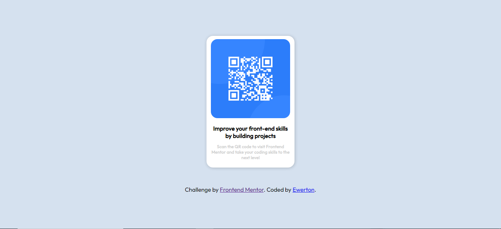

# Frontend Mentor - QR code component solution

This is a solution to the [QR code component challenge on Frontend Mentor](https://www.frontendmentor.io/challenges/qr-code-component-iux_sIO_H). Frontend Mentor challenges help you improve your coding skills by building realistic projects. 

## Table of contents

- [Overview](#overview)
  - [Screenshot](#screenshot)
- [My process](#my-process)
  - [Built with](#built-with)
  - [What I learned](#what-i-learned)
- [Author](#author)
- [Acknowledgments](#acknowledgments)

## Overview

### Screenshot

## My process

### Built with

- HTML5 
- Flexbox
- SASS

### What I learned

This is my first project using SASS, although it was not complex, I learned a lot about its syntax

## Author

- Profile - [Ewerton Silva](https://github.com/ewerton-html)
- Frontend Mentor - [Eweron Silva](https://www.frontendmentor.io/profile/Ewerton-Tv)

## Acknowledgments

Currently, all images used in the project are from Frontend Mentor

**Note: Delete this note and edit this section's content as necessary. If you completed this challenge by yourself, feel free to delete this section entirely.**
